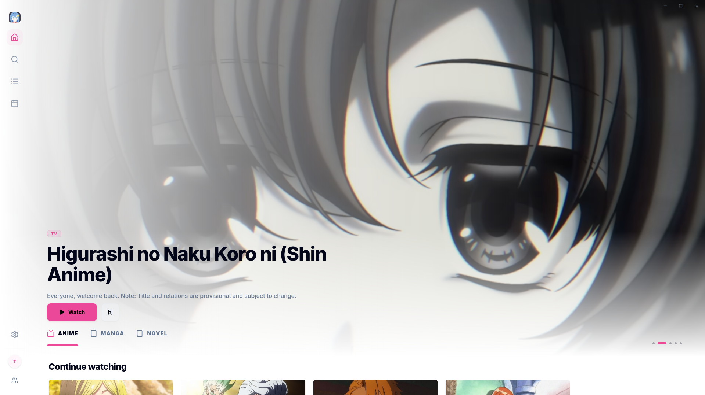

<p align="center">
  
</p>

<h1 align="center">Hoshi ⭐</h1>

<p align="center">
  A clean, lightweight, and cross-platform tracker for anime, manga, and light novels. <br>
  Built to be <strong>potato-proof</strong>.
</p>

<p align="center">
  
  <a href="https://github.com/dot-fx/hoshi/releases">
    
  </a>
  <a href="https://github.com/dot-fx/hoshi/releases">
    
  </a>
  <a href="https://github.com/dot-fx/hoshi/blob/main/LICENSE">
    
  </a>
</p>


---
## Features

-  **Smart Tracking:** Sync your library with AniList, MAL, or Kitsu. You can keep everything local if you prefer. Duplicate entries are automatically detected and merged into a single item.
-  **BYOC Extensions:** Bring your own content by adding marketplace URLs. Browse and install extensions directly from the app.
-  **Advanced Readers & Player:** Includes a custom video player, along with custom, highly configurable readers for manga and light novels.
-  **Release Schedule:** Stay up to date with a built-in calendar that shows upcoming anime releases and airing episodes at a glance.
-  **Customization:** Personalize the experience with themes and adjustable accent colors to match your style.
-  **15+ Languages:** Fully localized interface with support for 15+ languages (AI translations).

## Preview

<p align="center">
  
  &nbsp;&nbsp;
  
</p>

## Under the Hood

Hoshi is built with a modern, performance-focused stack:

- **Frontend:** SvelteKit (static) with Tailwind CSS and shadcn-svelte for a fast, responsive UI.
- **Backend/Core:** Rust + Tauri for a lightweight, native desktop experience.
- **Database:** SQLite via rusqlite for simple and reliable local storage.
- **Extensions Sandbox:** QuickJS, providing a secure and isolated runtime for extensions.

## Downloads

Check out the [Releases](https://github.com/dot-fx/hoshi/releases) page to download the latest version for your platform.

### Arch-based distributions

```bash
yay -S hoshi-bin
```

---
> **Credits:** Data via [AniList](https://anilist.co/), [MAL](https://myanimelist.net/), [Kitsu](https://kitsu.app/) • Mappings by [MangaBaka](https://mangabaka.org/) & [animeApi](https://github.com/nattadasu/animeApi)

## ⚖️ Disclaimer

Hoshi is primarily a tracking and management tool. The built-in readers and players are designed to work with user-provided content (Bring Your Own Content). The developers of Hoshi do not host, provide, or link to any copyrighted media. Users are solely responsible for the content they consume and the extensions they install.

---

<p align="center">
  
</p>
<p align="center">
  If you like Hoshi, consider giving it a ⭐. After all, hoshi means star.
</p>